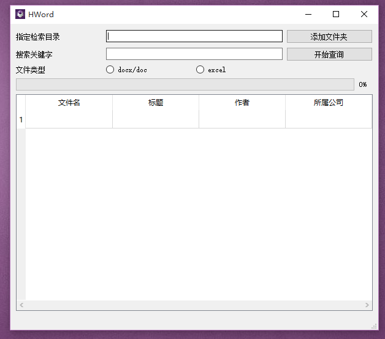

## 文件检索属性权限修改器

## 打包方式

>  pyinstaller -F -w --icon="./img/aqx2y-3232.ico" main.py

## 效果图




## 图标显示问题

问题描述：PyQt5 打包没有icon图标

1. 创建`resource.qrc`文件，写入以下内容：（相对路径）

   ```python
   <RCC>
       <qresource prefix="/">
           <file>img/hword.ico</file>
       </qresource>
   </RCC>
   ```

2. 生成`py`文件，这个`py`文件把图片序列化为二进制了

   > pyrc5 -o resource.py resource.qrc

3. 在项目中导入模块, 设置图标

   ```python
   self.setWindowIcon(QIcon(':/img/hword.ico'))
   ```


## 参考资料

[Python and Microsoft Office – Using PyWin32](http://www.blog.pythonlibrary.org/2010/07/16/python-and-microsoft-office-using-pywin32/)

[office 各个属性参考网站](https://bettersolutions.com/excel/workbooks/vba-properties.htm)

[Pyqt walk 在Windows查找文件](https://www.cnblogs.com/dcb3688/p/4608031.html)