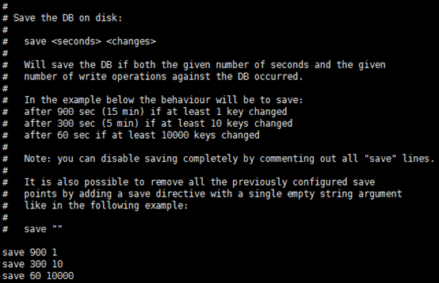
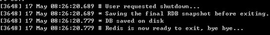
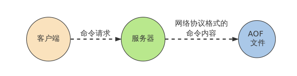
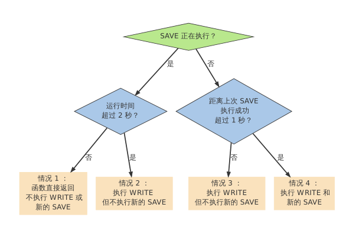
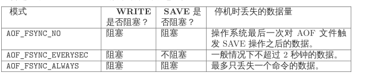
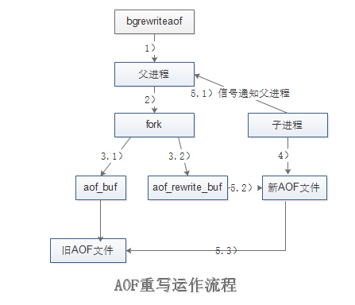
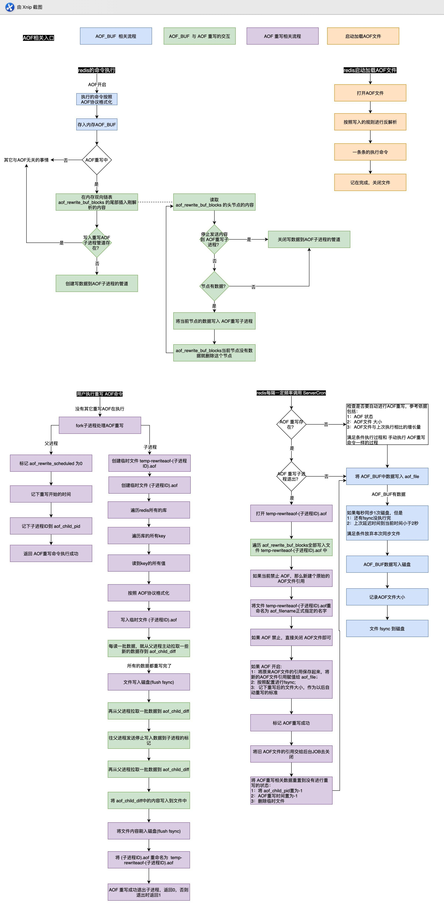
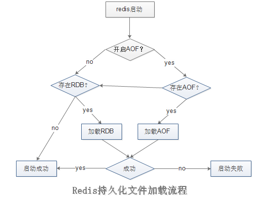

# Redis 持久化设计

持久化的功能：Redis是内存数据库，数据都是存储在内存中的，为了避免进程退出导致数据的永久丢失，要定期将Redis中的数据以某种形式从内存保存到硬盘，当下次Reids重启时，利用持久化文件实现数据恢复。

**RDB：将当前数据保存到硬盘**

**AOF：将每次执行的写命令保存到硬盘（类似MySQL的binlog）**

## 1. RDB持久化

RDB持久化是将当前进程中的数据生成快照保存到硬盘(因此也称作快照持久化)，保存的文件后缀是rdb；当Redis重新启动时，可以读取快照文件恢复数据。

1. 触发条件
   
   - 手动触发 save 命令和bgsave命令都可以生成RDB文件, save命令会阻塞Redis服务进程，知道RDB文件创建完毕，bgsave命令则是创建一个子进程，由子进程来负责创建RDB文件，父进程继续处理请求，bgsave命令执行过程中，只有fork子进程时会阻塞服务器，而对于save命令，整个过程都会阻塞服务器，因此save已基本被废弃，线上环境要杜绝save的使用；后文中也将只介绍bgsave命令。此外，在自动触发RDB持久化时，Redis也会选择bgsave而不是save来进行持久化
   
   >SAVE 执行期间，AOF 写入可以在后台线程进行，BGREWRITEAOF 可以在子进程进行，所以这三种操作可以同时进行 ，为了避免性能问题，BGSAVE 和 BGREWRITEAOF 不能同时执行
   
2. 自动触发

> **save m n**

在配置文件中通过 save m n 命令，指定当前m秒内发生n次变化时，触发bgsave。



​		其中save 900 1的含义是：当时间到900秒时，如果redis数据发生了至少1次变化，则执行bgsave；save 300 10和save 60 10000同理。当三个save条件满足任意一个时，都会引起bgsave的调用.

Redis的save m n，是通过serverCron函数、dirty计数器、和lastsave时间戳来实现的- 

- serverCron函数，是Redis服务器的周期性操作函数，默认每隔100ms执行一次，该函数对服务器的状态进行维护，其中一项工作就是检测save m n 配置是否满足条件，如果满足就执行bgsave.
- dirty计数器 记录服务器进行了多少起操作，修改，不是客户端执行了多少修改数据的命令
- lastsave时间戳也是Reids服务器维持的一个状态，记录上一次成功执行bgsave的时间

> save m n的原理如下：每隔100ms，执行serverCron函数；在serverCron函数中，遍历save m n配置的保存条件，只要有一个条件满足，就进行bgsave。对于每一个save m n条件，只有下面两条同时满足时才算满足：
>
> - 当前时间-lastsave > m
>
> - dirty >= n

在主从复制场景下，如果从节点执行全量复制操作，则主节点会执行bgsave命令，并将rdb文件发送给从节点。

在执行shutdown命令时，自动执行rdb持久化



### 1.2 RDB文件

#### 设置存储路径

	- 配置文件：dir配置指定目录，dbfilename指定文件名。默认是Redis根目录下的dump.rdb文件
	- 动态设置： 

> config set dir {newdir}  ///  config set dbfilename {newFileName}

RDB文件 是经过压缩的二进制文件，默认采用LZF算法对RDB文件进行压缩，虽然压缩耗时，但是可以大大减小文件体积，默认是开启的，可以通过命令关闭：

> config set rdbcompression no

RDB文件的压缩并不是针对整个文件进行的，而是对数据库中的字符串进行的，且只有在字符串达到一定长度(20字节)时才会进行

格式:


字段说明：

1) REDIS常量，保存‘REDIS'5个字符

2) db_version RDB文件的版本号

3) SELECTDB 表示一个完整的数据库(0号数据库)，同理`SELECTDB 3 pairs`表示完整的3号数据库；只有当数据库中有键值对时，RDB文件中才会有该数据库的信息(上图所示的Redis中只有0号和3号数据库有键值对)；如果Redis中所有的数据库都没有键值对，则这一部分直接省略。其中：SELECTDB是一个常量，代表后面跟着的是数据库号码；0和3是数据库号码；

4) KEY-VALUE-PAIRS: pairs则存储了具体的键值对信息，包括key、value值，及其数据类型、内部编码、过期时间、压缩信息等等


5) EOF 标志着数据库内容的结尾（不是文件的结尾），值为 rdb.h/EDIS_RDB_OPCODE_EOF （255）

6) CHECK-SUM RDB 文件所有内容的校验和，一个 uint_64t 类型值, REDIS 在写入 RDB 文件时将校验和保存在 RDB 文件的末尾，当读取时，根据它的值对内容进行校验

。如果这个域的值为 0 ，那么表示 Redis 关闭了校验和功能。

### 1.3 启动时加载

​		RDB文件的载入工作是在服务器启动时自动执行的，并没有专门的命令。但是由于AOF的优先级更高，因此当AOF开启时，Redis会优先载入AOF文件来恢复数据；只有当AOF关闭时，才会在Redis服务器启动时检测RDB文件，并自动载入。服务器载入RDB文件期间处于阻塞状态，直到载入完成为止

## 2. AOF持久化

AOF(Append Only File) 则以协议文本的方式，将所有对数据库进行过写入的命令（及其参数）记录到 AOF
文件，以此达到记录数据库状态的目的



### 2.1 开启AOF

Redis服务器默认开启RDB，关闭AOF；要开启AOF，需要在配置文件中配置：

> appendonly yes

### 2.2 执行流程

#### 2.2.1 命令写入缓冲区

```c++
//缓冲区的定义 是一个SDS, 可以兼容C语言的字符串
struct redisServer {
    // AOF缓冲区， 在进入事件loop之前写入
    sds aof_buf;
};
```


1. 命令传播： Redis将执行完的命令、命令的参数、命令的参数个数等信息发送到 AOF 程序中

2. 缓存追加： AOF程序根据接收到的命令命令数据，将命令转换为网络通讯协议的格式，然后将协议内容追加到服务器的 AOF 缓存中。

   - 将命令以文本协议格式保存在缓存中
   - 为什么使用文本协议格式？兼容性，避免二次开销，可读性
   - 为什么写入缓存？这样不会受制于磁盘的IO性能，避免每次有写命令都直接写入硬盘，导致硬盘IO成为Redis负载的瓶颈

3. 文件写入和保存：AOF 缓存中的内容被写入到 AOF 文件末尾，如果设定的 AOF 保存
   条件被满足的话，fsync 函数或者 fdatasync 函数会被调用，将写入的内容真正地保存到磁盘中。

   为了提高文件写入效率，在现代操作系统中，当用户调用write函数将数据写入文件时，操作系统通常会将数据暂存到一个内存缓冲区里，当缓冲区被填满或超过了指定时限后，才真正将缓冲区的数据写入到硬盘里。这样的操作虽然提高了效率，但也带来了安全问题：如果计算机停机，内存缓冲区中的数据会丢失；因此系统同时提供了fsync、fdatasync等同步函数，可以强制操作系统立刻将缓冲区中的数据写入到硬盘里，从而确保数据的安全性。

   **AOF保存模式：**

   - **AOF_FSYNC_ALWAYS**: 命令写入aof-buf后立即调用系统的fsync操作同步到AOF文件。因为 SAVE 是由 Redis 主进程执行的，所以在 SAVE 执行期间，主进程会被阻塞，不能接受命令请求。这种情况下，每次有写命令都要同步到AOF文件，硬盘IO成为性能瓶颈，Redis只能支持大约几百TPS写入，严重降低了Redis的性能；即便是使用固态硬盘（SSD），每秒大约也只能处理几万个命令，而且会大大降低SSD的寿命。
   - **AOF_FSYNC_NO**: 命令写入aof_buf后调用系统write操作，不对AOF文件做fsync同步；**同步由操作系统负责，通常同步周期为30秒**。这种情况下，文件同步的时间不可控，且缓冲区中堆积的数据会很多，数据安全性无法保证。在数据只作为缓存的情况下，可以设置为这个，并修改bgsave的缓存频率，减小进程的阻塞。[Redis被bgsave和bgrewriteaof阻塞的解决方法]([http://www.xiaotanzhu.com/%E5%88%86%E5%B8%83%E5%BC%8F%E7%B3%BB%E7%BB%9F/2016/07/20/redis-blocked-by-disk-ops](http://www.xiaotanzhu.com/分布式系统/2016/07/20/redis-blocked-by-disk-ops))
   - **AOF_FSYNC_EVERYSEC**: 每一秒钟保存一次,命令写入aof_buf后调用系统write操作, write完成后线程返回， fsync同步文件操作由专门线程每秒调用一次

   

   

#### 2.2.2. 文件重写

随着命令不断写入AOF，文件会越来越大，为了解决这个问题，Redis引入AOF重写机制压缩文件体积，AOF文件重写是把Redis进程内的数据转化为写命令同步到新AOF文件的过程。

重写后的AOF文件为什么可以变小？

1. 进程内已经超时的数据不再写入文件
2. 旧的AOF文件含有无效命令 ，如有些数据被重复设值(set mykey v1, set mykey v2)、有些数据被删除了(sadd myset v1, del myset)等等， 新的**AOF文件只保留最终的数据**写入命令
3. **多条写入命令可以合并为一个**，如：lpush list a、lpush list b可以转化为：lpush list a b。为了防止单条命令过大造成客户端缓冲区溢出，对于list、set、hash等类型操作，以64个元素为边界拆分为多条

AOF重写可以手动触发也可以自动触发：

- 手动触发： 直接调用`bgrewriteaof`命令
- 自动触发：根据`auto-aof-rewrite-min-siz`e和`auto-aof-rewrite-percentage`参数确定自动触发时机。
  - `auto-aof-rewrite-min-size`：表示运行AOF重写时文件最小体积，默认为64MB
  - `auto-aof-rewrite-percentage`：代表当前AOF文件空间(`aof_current_size`)和上一次重写后AOF文件空间(`aof_base_size`)的比值



> 关于重写的流程，有两点需要特别注意的：
>
> (1)重写由父进程fork子进程进行；
>
> (2)重写期间Redis执行的写命令，需要追加到新的AOF文件中，为此Redis引入了`aof_rewrite_buf`缓存


流程说明：

1）执行AOF重写请求。

如果当前进程正在执行AOF重写，请求不执行。

如果当前进程正在执行`bgsave`操作，重写命令延迟到`bgsave`完成之后再执行。

2）父进程执行fork创建子进程，开销等同于`bgsave`过程。

3.1）主进程fork操作完成后，`bgrewriteaof`命令返回*”Background append only file rewrite started”*, 继续响应其它命令。

　　所有修改命令依然写入AOF文件缓冲区并根据`appendfsync`策略同步到磁盘，保证原有AOF机制正确性。

3.2）由于fork操作运用***[写时复制技术](https://www.cnblogs.com/biyeymyhjob/archive/2012/07/20/2601655.html)***，子进程只能共享fork操作时的内存数据

　　由于父进程依然响应命令，Redis使用“AOF”重写缓冲区保存这部分新数据，防止新的AOF文件生成期间丢失这部分数据。**也就是说，bgrewriteaof执行期间，Redis的写命令同时追加到aof_buf和aof_rewirte_buf两个缓冲区。**

4）子进程依据内存快照，按照命令合并规则写入到新的AOF文件。

　　每次批量写入硬盘数据量由配置`aof-rewrite-incremental-fsync`控制，默认为32MB，防止单次刷盘数据过多造成硬盘阻塞。

5.1）新AOF文件写入完成后，子进程发送信号给父进程，父进程调用一个信号处理函数，并执行以前操作更新统计信息。

5.2）父进程把AOF重写缓冲区的数据写入到新的AOF文件。这时新 AOF 文件所保存的数据库状态将和服务器当前的数据库状态一致。

5.3）对新的AOF文件进行改名，原子地(atomic)覆盖现有的AOF文件，完成新旧文件的替换。

在整个 AOF 后台重写过程中，只有信号处理函数执行时会对服务器进程（父进程）造成阻塞，其他时候，AOF 后台重写都不会阻塞父进程，这将 AOF 重写对服务器性能造成的影响降到了最低

[《Redis-设计与实现：AOF-持久化》](https://xiangyq000.github.io/2017/10/14/%E3%80%8ARedis-%E8%AE%BE%E8%AE%A1%E4%B8%8E%E5%AE%9E%E7%8E%B0%EF%BC%9AAOF-%E6%8C%81%E4%B9%85%E5%8C%96%E3%80%8B/)



#### 2.2.3 重启加载



流程说明：

1）AOF持久化开启且存在AOF文件时，优先加载AOF文件。

2）AOF关闭或者AOF文件不存在时，加载RDB文件。

3）加载AOF/RDB文件成功后，Redis启动成功。

4）AOF/RDB文件存在错误时，Redis启动失败并打印错误信息。

数据还原的详细步骤：

1. 创建一个不带网络连接的**伪客户端（fake client）**: 因为 Redis 的命令只能在客户端上下文中执行，而载入 AOF 文件时所使用的命令直接来源于 AOF 文件而不是网络连接，所以服务器使用了一个没有网络连接的伪客户端来执行 AOF 文件保存的写命令，伪客户端执行命令的效果和带网络连接的客户端执行命令的效果完全一样。
2. 从AOF文件中分析并读取出一条写命令，使用伪客户端执行被读出的写命令，重复此操作，直到AOF文件中的所有写命令都被处理完毕为止。

#### 2.2.4 文件校验

加载损坏的AOF文件会拒绝启动，并打印错误信息。

注意：对于错误格式的AOF文件，先进性备份，然后采用`redis-check-aof --fix`命令进行修复，修复后使用diff -u对比数据差异，找到丢失的数据，有些可以进行人工补全。

AOF文件可能存在结尾不完整的情况，比如机器突然掉电导致AOF尾部文件命令写入不全。

Redis为我们提高了`aof-load-truncated`配置来兼容这种情况，默认开启

### 2.2.5 AOF常用配置总结

- appendonly no: 是否开启AOF
- appendfilename 'appendonly.aof': AOF文件名
- dir / : RDB文件和AOF文件存储目录
- appendfsync everysec: fsync 持久化策略
- no-appendfsync-on-rewrite no: AOF重写期间是否禁止fsync；如果开启该选项，可以减轻文件重写时CPU和硬盘的负载（尤其是硬盘），但是可能会丢失AOF重写期间的数据；需要在负载和安全性之间进行平衡
- auto-aof-rewrite-percentage 100：文件重写触发条件之一
- auto-aof-rewrite-min-size 64mb：文件重写触发提交之一
- of-load-truncated yes：如果AOF文件结尾损坏，Redis启动时是否仍载入AOF文件


## 3. 了解MySQL中的binlog

[mysql binlog应用场景与原理深度剖析](http://www.jiangxinlingdu.com/mysql/2019/06/07/binlog.html)


## **参考博文与书籍：**

1. 《redis设计与实现》
2. [Redis持久化](https://www.cnblogs.com/kismetv/p/9137897.html)
3. [徐刘根-Redis实战和核心原理详解（8）使用快照RDB和AOF将Redis数据持久化到硬盘中](https://blog.csdn.net/xlgen157387/article/details/61925524)