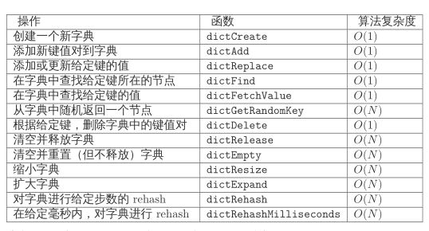
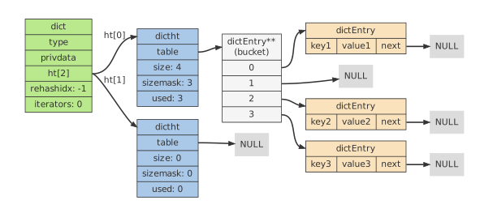
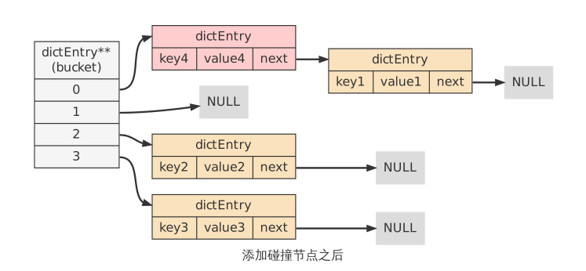

## Redis的内存和实现机制


## 1. Reids内存的划分

1. 数据 内存统计在used_memory中
2. 进程本身运行需要内存  Redis主进程本身运行需要的内存占用，代码、常量池等
3. 缓冲内存，客户端缓冲区、复制积压缓冲区、AOF缓冲区。有jemalloc分配内存，会统计在used_memory中
4. 内存碎片 Redis在分配、回收物理内存过程中产生的。内存碎片不会统计在used_memory中。如果Redis服务器中的内存碎片已经很大，可以通过安全重启的方式减小内存碎片：因为重启之后，Redis重新从备份文件中读取数据，在内存中进行重排，为每个数据重新选择合适的内存单元，减小内存碎片。


## 2. Redis的数据存储的细节

**推荐好文-《[Redis内部数据结构详解](http://mp.weixin.qq.com/s?__biz=MzA4NTg1MjM0Mg==&mid=2657261203&idx=1&sn=f7ff61ce42e29b874a8026683875bbb1&scene=21#wechat_redirect)》--- 微爱CTO-张铁蕾**

涉及到内存分配器jemalloc， 简单动态字符串（SDS），5种值类型对象的内部编码，redisObject, 


1. DictEntry: Redis 是key-value数据库，因此对每个键值对都会有一个dictEntry，里面存储了指向Key和Value的指针；next指向下一个dictEntry，与本Key-Value无关
2. Key: 并不是以字符串存储，而是存储在SDS结构中
3. RedisObject: 5种值对象不是直接以对应的类型存储的，而是被封装为redisObject来存储
4. jemalloc: 无论是DictEntry对象，还是redisObject, SDS对象，都需要内存分配器

### 2.1 Jemalloc

redis 在编译时便会指定内存分配器， 内存分配器可以是libc、jemalloc、tcmalloc

jemalloc作为Redis的默认内存分配器，在减小内存碎片方面做的相对比较好。jemalloc在64位系统中，将内存空间划分为小、大、巨大三个范围；每个范围内又划分了许多小的内存块单位；当Redis存储数据时，会选择大小最合适的内存块进行存储。


### 2.2 RedisObject

redis对象的类型，内部编码，内存回收，共享对象等功能都需要RedisObject的支持

```c++
typedef struct redisObject{
    unsigned type: 4;
    unsigned encoding: 4;
    unsigned lru: REDIS_LRU_BITS; /*lru time*/
    int refcount;
    void *ptr;
} robj;
```

- **type 字段** 占4bit 目前有5中类型， REDIS_STRING, REDIS_LIST, REDIS_HASH, REDIS_SET,  REDIS_ZSET。 当执行type命令时，便是通过读取redisObject对象的type字段获取对象类型
- **encoding** 占4bit （表示对象的内部编码），对于redis支持的每种类型，都有至少两种内部编码。**通过object encoding命令，可以查看对象采用的编码方式**
  - 对于字符串，有int, embstr, raw 三种编码。 
  - 对于列表， 有压缩列表和双端列表两种编码方式，如果列表中元素较少，redis倾向于使用压缩列表进行存储，因为压缩列表内存占用少，而且比双端链表可以更快载入；当列表对象元素较多时，压缩列表就会转化为更适合存储大量元素的双端链表。
- **lru** 不同版本占用内存大小不一样，4.0版本占用24bit,2.6版本占用22bit
  - 记录的是对象最后一次被命令程序访问的时间，通过对比lru时间和当前时间，可以计算某个对象的空转时间，**object idletime命令可以显示该空转时间 秒级别，改命令并不会改变对象的lru值**，lru值除了通过`object idletime`命令打印之外，还与Redis的内存回收有关系：如果Redis打开了`maxmemory`选项，且内存回收算法选择的是`volatile-lru`或`allkeys—lru`，那么当Redis内存占用超过`maxmemory`指定的值时，**Redis会优先选择空转时间最长的对象进行释放**。
- **refcount 共享对象** **记录对象的引用计数，协助内存回收**，**引用计数可以通过 object refcount命令查看**
  - **共享对象的具体实现**
  - Redis共享对象目前只支持整数值的对象。实际上是对内存和CPU时间的衡量。共享对象虽然会降低内存消耗，但是判断两个对象是否相等时需要消耗时间的。，对于整数值，判断操作复杂度为O(1)；对于普通字符串，判断复杂度为O(n)；而对于哈希、列表、集合和有序集合，判断的复杂度为O(n^2)。
  - 虽然共享对象只能是整数值的字符串对象，但是5种类型都可能使用共享对象（如哈希、列表等的元素可以使用）。reids服务器在初始化时，会创建10000个字符串对象，值分别是0-9999的整数值。**10000这个数字可以通过调整参数REDIS_SHARED_INTEGERS（4.0中是OBJ_SHARED_INTEGERS）的值进行改变**
- ptr 指针指向具体的数据 如 set hello world  ptr指向包含字符串world的SDS
- RedisObject对象大小16字节  4bit+4bit+24bit+4Byte+8Byte=16Byte

## 3. Redis内部数据结

### 3.1 SDS 简单动态字符串 

结构


```c++
struct sdshdr {
	int len;  // 记录buf数组中已使用字节的数量 等于SDS所保存字符串的长度
    int free;  // 记录buf数组中未使用的字节数量
    char buf[];
};
```

1. SDS结构 占据的空间：free+len+buf(表示字符串结尾的空字符串)， 其中buf=free+len+1. 则总长度为4+4+free+len+1=free+len+9

2. 与C字符串的比较

   在C字符串的基础上加入了free和len字段，**优势**

   - **获取字符串长度**： SDS O(1), C字符串是O(n)
   - **缓冲区溢出**：使用C字符串的API时，如果字符串长度增加（如strcat操作）而忘记重新分配内存，很容易造成缓冲区的溢出；而SDS由于记录了长度，相应的API在可能造成缓冲区溢出时会自动重新分配内存，杜绝了缓冲区溢出。
   - **修改字符串内存的重分配**：对于C字符串，如果要修改字符串，必须要重新分配内存（先释放再申请），因为如果没有重新分配，字符串长度增大时会造成内存溢出，字符串长度减小时会造成内存泄漏。对于SDS, 由于记录了len和free，因此解除了字符串长度和空间数组长度之间的关联，可以在此基础上进行优化：**空间预分配**(分配内存时比实际需要的多)使得字符串长度增大时重新分配内存的概率减小。**惰性空间释放策略** 惰性空间释放用于优化 SDS 的字符串缩短操作： 当 SDS 的 API 需要缩短 SDS 保存的字符串时， 程序并不立即使用内存重分配来回收缩短后多出来的字节， 而是使用 free 属性将这些字节的数量记录起来， 并等待将来使用。
   - **二进制安全** C 字符串中的字符必须符合某种编码（比如 ASCII）， 并且除了字符串的末尾之外， 字符串里面不能包含空字符， 否则最先被程序读入的空字符将被误认为是字符串结尾 —— 这些限制使得 C 字符串只能保存文本数据， 而不能保存像图片、音频、视频、压缩文件这样的二进制数据。
     SDS 的 API 都是二进制安全的（binary-safe）： 所有 SDS API 都会以处理二进制的方式来处理 SDS 存放在 `buf` 数组里的数据， 程序不会对其中的数据做任何限制、过滤、或者假设 —— 数据在写入时是什么样的， 它被读取时就是什么样。

   **总结：**

   - Redis 的字符串表示为 sds ，而不是 C 字符串（以 \0 结尾的 char*）。

   - 对比 C 字符串，sds 有以下特性：
     – 可以高效地执行长度计算（strlen）；
       		– 可以高效地执行追加操作（append）；
       		– 二进制安全；
   - sds 会为追加 操作进行优化：加快追加操作的速度，并降低内存分配的次数，代价是多占用了一些内存，而且这些内存不会被主动释放。

### 3.2 双端链表


### 3.3 字典

在Redis中的应用： 

1. 实现数据库键空间(key space) Redis 是一个键值对数据库，数据库中的键值对就由典保存：每个数据库都有一个与之相对应的字典，这个字典被称之为键空间（key space。
2. 用作Hash类型键的其中一种底层实现

**HashCode 的算法 **  [漫谈非加密哈希算法](https://segmentfault.com/a/1190000010990136)

Redis 目前使用两种不同的哈希算法：

- MurmurHash2 32 bit 算法：这种算法的分布率和速度都非常好，具体信息请参考 MurmurHash 的主页：http://code.google.com/p/smhasher/ 。
- 基 于 djb 算 法 实 现 的 一 个 大 小 写 无 关 散 列 算 法： 具 体 信 息 请 参 考
  http://www.cse.yorku.ca/~oz/hash.html 。
- 使用哪种算法取决于具体应用所处理的数据：
  • 命令表以及 Lua 脚本缓存都用到了算法 2 。
  • 算法 1 的应用则更加广泛：数据库、集群、哈希键、阻塞操作等功能都用到了这个算法。  

Redis 的 Hash 类型键使用以下两种数据结构作为底层实现：

1. 字典；
2. 压缩列表

#### 3.3.1 字典的底层实现

实现字典的方法有很多种:

- 最简单的就是使用链表和数组，方式只适用于元素个数不多的情况
- 兼顾高效和简单性，使用哈希表
- 追求更稳定的性能特征，并且希望高效的实现排序操作，可以是用更为复杂的平衡树

**Reids选择了高效且实现简单的哈希表作为字典的底层实现。**

```c++
/* dict.h/dict
* 字典
*
* 每个字典使用两个哈希表，用于实现渐进式 rehash
*/

typedef struct dict {
    dictType *type;  // 特定于类型的处理函数
    void *privdata;  // 类型处理函数的私有数据
    dictht ht[2];   // 2个哈希表
    
    int rehashidx;  // 记录rehash 进度的标志, 值为-1  表示rehash未进行
    
    int iterators;   // 当前正在运作的安全迭代器数量
} dict;
```



**注：** dict类型使用了两个指针分别指向两个哈希表

其中，0号哈希表（ht[0]）是字典主要使用的哈希表，而 1号哈希表（ht[1]）则只有对0号哈希表进行rehash时才使用。

#### 3.3.2 哈希表的实现

```c++
/*哈希表*/
typedef struct dictht {
    dictEntry **table;   // 哈希表节点指针数组（俗称桶， bucket）
    unsigned long size;  //指针数组的大小
    unsigned long sizemask;   //指针数组的长度掩码
    unsigned long used;   // 哈希表现有的节点数量
}dictht;
```

```c++
/*哈希表节点*/
typedef struct dictEntry {
    void *key;
    union {
        void *val;
        uint64_t u64;
        int64_t s64;
    } v;
    
    // 链接后继系节点
    struct dictEntry *next;
} dictEntry;
```

next 属性指向另一个dictEntry结构, 多个dictEntry 可以通过next指针串连成链表dictht**使用链地址法来处理键碰撞**；**当多个不同键拥有相同的哈希值时，哈希表用一个链表将这些键连接起来**。




#### 3.3.3 哈希碰撞

在哈希表实现中，当两个不同的键拥有相同的哈希值时，我们称这两个键发生碰撞（collision），而哈希表实现必须想办法对碰撞进行处理。字典哈希表所使用的碰撞解决方法被称之为链地址法：这种方法使用链表将多个哈希值相同的节点串连在一起，从而解决冲突问题。

假设现在有一个带有三个节点的哈希表：


对于一个新的键值对 key4 和 value4 ，如果 key4 的哈希值和 key1 的哈希值相同，那么它们将在哈希表的 0 号索引上发生碰撞。



#### 3.2.4 添加新键值对时触发rehash操作？

对于使用链地址法来解决碰撞问题的哈希表 dictht 来说，哈希表的性能依赖于它的大小（size属性）和它所保存的节点的数量（used 属性）之间的比率：比率最好在1：1。

## 4. 跳跃表


跳跃表是一种随机化数据结果，查找、添加、删除操作都可以在对数期望时间下完成

跳跃表目前在Redis的唯一作用就是作为有序集类型的底层数据结构之一

Redis对跳跃表进行了修改包括：

- score值可重复
- 对比一个元素需要同时检查它的score和member
- 每个节点带有高度为1层的后退指针，用于从表尾方向向表头方向迭代

[Redis 为什么用跳表而不用平衡树？](https://juejin.im/post/57fa935b0e3dd90057c50fbc#heading-8)

### 4.1 skiplist与平衡树、哈希表的比较

- skiplist和各种平衡树（如AVL、红黑树等）的元素是有序排列的，而哈希表不是有序的。因此，在哈希表上只能做单个key的查找，不适宜做范围查找。所谓范围查找，指的是查找那些大小在指定的两个值之间的所有节点。
- 在做范围查找的时候，平衡树比skiplist操作要复杂。在平衡树上，我们找到指定范围的小值之后，还需要以中序遍历的顺序继续寻找其它不超过大值的节点。如果不对平衡树进行一定的改造，这里的中序遍历并不容易实现。而在skiplist上进行范围查找就非常简单，只需要在找到小值之后，对第1层链表进行若干步的遍历就可以实现。
- 平衡树的插入和删除操作可能引发子树的调整，逻辑复杂，而skiplist的插入和删除只需要修改相邻节点的指针，操作简单又快速。
- 从内存占用上来说，skiplist比平衡树更灵活一些。一般来说，平衡树每个节点包含2个指针（分别指向左右子树），而skiplist每个节点包含的指针数目平均为1/(1-p)，具体取决于参数p的大小。如果像Redis里的实现一样，取p=1/4，那么平均每个节点包含1.33个指针，比平衡树更有优势。
- 查找单个key，skiplist和平衡树的时间复杂度都为O(log n)，大体相当；而哈希表在保持较低的哈希值冲突概率的前提下，查找时间复杂度接近O(1)，性能更高一些。所以我们平常使用的各种Map或dictionary结构，大都是基于哈希表实现的。
- 从算法实现难度上来比较，skiplist比平衡树要简单得多。


## Redis的对象类型和内部编码

### 1. 字符串


#### 1.1 内部编码

- int 8个字节的长整型。字符串值是整型时，这个值使用long整型表示
- embstr <=39字节的字符串。embstr与raw都使用redisObject和sds保存数据，区别在于，**embstr的使用只分配一次内存空间（因此redisObject和sds是连续的）**，而**raw需要分配两次内存空间（分别为redisObject和sds分配空间）**。因此与raw相比，embstr的好处在于创建时少分配一次空间，删除时少释放一次空间，以及对象的所有数据连在一起，寻找方便。**而embstr的坏处也很明显，如果字符串的长度增加需要重新分配内存时，整个redisObject和sds都需要重新分配空间，因此redis中的embstr实现为只读**。
- raw: 大于39个字节的字符串

#### 1.2 编码转换

新创建的字符串默认使用 REDIS_ENCODING_RAW 编码，在将字符串作为键或者值保存进数据库时，程序会尝试将字符串转为 REDIS_ENCODING_INT 编码, 字符串的长度不超过512MB

### 2. 列表


创建新列表时Redis默认使用REDIS_ENCODING_ZIPLIST编码，当一下任意一个条件满足时，列表会被转换成REDIS_ENCODING_LINKEDLIST编码：

- 试图往列表新添加一个字符串值，且这个字符串的长度超过sever.list_max_ziplist_value(默认值是64)
- ziplist 包含的节点超过server.list_max_ziplist_entries(默认的值为512)

且编码只可能由压缩列表转化为双端链表，一个列表可以存储2^32-1个元素

#### 2.1 压缩列表

压缩列表是Redis为了节约内存而开发的，由一系列特殊编码的连续内存块(而不是像双端链表每个节点都是指针) 顺序型数据结构；与双端链表相比，压缩列表可以节省内存空间，但是进行修改或增删操作时，复杂度较高；因此当节点数量较少时，可以使用压缩列表；但是节点数量多时，还是使用双端链表划算。因为 ziplist 节约内存的性质，它被哈希键、列表键和有序集合键作为初始化的底层实现来使
用

#### 2.2 双端链表


```c++
typedef struct listNode {
    struct listNode *prev;  //前驱节点
    struct listNode *next;  // 后继节点
    void *value;
} listNode;

typedef struct list {
    //表头指针
    listNode *head;
    //表尾指针
    listNode *tail;
    unsigned long len; // 节点长度
    void *(*dup) (void *ptr);
    void (*freee)(void *ptr);
    int (*match) (void *ptr, void *key);
}list;
```

小结：

作为Reids列表的底层实现之一； 作为通用数据结构，被其他功能模块使用。

- 节点带有前驱和后继指针，访问前驱节点和后继节点的复杂度为 O(1) ，并且对链表
  的迭代可以在从表头到表尾和从表尾到表头两个方向进行；
-  链表带有指向表头和表尾的指针，因此对表头和表尾进行处理的复杂度为 O(1) ；
- 链表带有记录节点数量的属性，所以可以在 O(1) 复杂度内返回链表的节点数量（长
  度）；

#### 2.3 quicklist

转自[微爱CTO-张铁蕾Redis内部数据结构详解-quicklist](http://zhangtielei.com/posts/blog-redis-quicklist.html)

Redis对外暴露的list数据类型，它底层实现所依赖的内部数据结构就是quicklist, quicklist实现基于Redis源码的3.2分支. list的内部实现quicklist正是一个双向链表,  `A doubly linked list of ziplists`, quicklist的每个节点都是一个ziplist

ziplist本身也是一个能维持数据项先后顺序的列表（按插入位置），而且是一个内存紧缩的列表（各个数据项在内存上前后相邻）。比如，一个包含3个节点的quicklist，如果每个节点的ziplist又包含4个数据项，那么对外表现上，这个list就总共包含12个数据项。

quicklist的结构为什么这样设计呢？总结起来，大概又是一个空间和时间的折中：

- 双向链表便于在表的两端进行push和pop操作，但是它的内存开销比较大。首先，它在每个节点上除了要保存数据之外，还要额外保存两个指针；其次，双向链表的各个节点是单独的内存块，地址不连续，节点多了容易产生内存碎片。
- ziplist由于是一整块连续内存，所以存储效率很高。但是，它不利于修改操作，每次数据变动都会引发一次内存的realloc。特别是当ziplist长度很长的时候，一次realloc可能会导致大批量的数据拷贝，进一步降低性能。

于是，结合了双向链表和ziplist的优点，quicklist就应运而生了。

不过，这也带来了一个新问题：到底一个quicklist节点包含多长的ziplist合适呢？比如，同样是存储12个数据项，既可以是一个quicklist包含3个节点，而每个节点的ziplist又包含4个数据项，也可以是一个quicklist包含6个节点，而每个节点的ziplist又包含2个数据项。

这又是一个需要找平衡点的难题。我们只从存储效率上分析一下：

- 每个quicklist节点上的ziplist越短，则内存碎片越多。内存碎片多了，有可能在内存中产生很多无法被利用的小碎片，从而降低存储效率。这种情况的极端是每个quicklist节点上的ziplist只包含一个数据项，这就蜕化成一个普通的双向链表了。
- 每个quicklist节点上的ziplist越长，则为ziplist分配大块连续内存空间的难度就越大。有可能出现内存里有很多小块的空闲空间（它们加起来很多），但却找不到一块足够大的空闲空间分配给ziplist的情况。这同样会降低存储效率。这种情况的极端是整个quicklist只有一个节点，所有的数据项都分配在这仅有的一个节点的ziplist里面。这其实蜕化成一个ziplist了。

可见，一个quicklist节点上的ziplist要保持一个合理的长度。那到底多长合理呢？这可能取决于具体应用场景。实际上，Redis提供了一个配置参数`list-max-ziplist-size`，就是为了让使用者可以来根据自己的情况进行调整。

```shell
list-max-ziplist-size -2
```

当取正值的时候，表示按照数据项个数来限定每个quicklist节点上的ziplist长度。比如，当这个参数配置成5的时候，表示每个quicklist节点的ziplist最多包含5个数据项，当取负值的时候，表示按照占用字节数来限定每个quicklist节点上的ziplist长度。这时，它只能取-1到-5这五个值：

- -5: 每个quicklist节点上的ziplist大小不能超过64 Kb。（注：1kb => 1024 bytes）
- -4: 每个quicklist节点上的ziplist大小不能超过32 Kb。
- -3: 每个quicklist节点上的ziplist大小不能超过16 Kb。
- -2: 每个quicklist节点上的ziplist大小不能超过8 Kb。（-2是Redis给出的默认值）
- -1: 每个quicklist节点上的ziplist大小不能超过4 Kb。

另外，list的设计目标是能够用来存储很长的数据列表的。比如，Redis官网给出的这个教程：[Writing a simple Twitter clone with PHP and Redis](http://redis.io/topics/twitter-clone)，就是使用list来存储类似Twitter的timeline数据。

当列表很长的时候，最容易被访问的很可能是两端的数据，中间的数据被访问的频率比较低（访问起来性能也很低）。如果应用场景符合这个特点，那么list还提供了一个选项，能够把中间的数据节点进行压缩，从而进一步节省内存空间。Redis的配置参数`list-compress-depth`就是用来完成这个设置的。

```
list-compress-depth 0
```

这个参数表示一个quicklist两端不被压缩的节点个数。注：这里的节点个数是指quicklist双向链表的节点个数，而不是指ziplist里面的数据项个数。实际上，一个quicklist节点上的ziplist，如果被压缩，就是整体被压缩的。

参数`list-compress-depth`的取值含义如下：

- 0: 是个特殊值，表示都不压缩。这是Redis的默认值。
- 1: 表示quicklist两端各有1个节点不压缩，中间的节点压缩。
- 2: 表示quicklist两端各有2个节点不压缩，中间的节点压缩。
- 3: 表示quicklist两端各有3个节点不压缩，中间的节点压缩。
- 依此类推…

由于0是个特殊值，很容易看出quicklist的头节点和尾节点总是不被压缩的，以便于在表的两端进行快速存取

Redis对于quicklist内部节点的压缩算法，采用的[LZF](http://oldhome.schmorp.de/marc/liblzf.html)——一种无损压缩算法。


上图是一个quicklist的结构图举例。图中例子对应的ziplist大小配置和节点压缩深度配置，如下：

```
list-max-ziplist-size 3
list-compress-depth 2
```

这个例子中我们需要注意的几点是：

- 两端各有2个橙黄色的节点，是没有被压缩的。它们的数据指针zl指向真正的ziplist。中间的其它节点是被压缩过的，它们的数据指针zl指向被压缩后的ziplist结构，即一个quicklistLZF结构。
- 左侧头节点上的ziplist里有2项数据，右侧尾节点上的ziplist里有1项数据，中间其它节点上的ziplist里都有3项数据（包括压缩的节点内部）。这表示在表的两端执行过多次`push`和`pop`操作后的一个状态。


### 3. 哈希表


- 当哈希表使用字典编码时，程序将哈希表的键（key）保存为字典的键，将哈希表的值（value）保存为字典的值, 字典的键和值都是字符串对象


- 压缩列表编码的哈希表


- 编码转换

  默认使用ziplist编码，当满足以下条件时，自动切换为字典编码

  - 哈希表中某个键或某个值的长度大于sever.hash_max_ziplist_value(默认值是64)
  - ziplist 包含的节点超过server.list_max_ziplist_entries(默认的值为512)

### 4. 集合


第一个添加到集合的元素，决定了创建集合时所使用的编码：

- 如果第一个元素可以表示为 long long 类型值（也即是，它是一个整数），那么集合的初始编码为 REDIS_ENCODING_INTSET 。
-  否则，集合的初始编码为 REDIS_ENCODING_HT 。

#### 4.1 内部编码

当使用 REDIS_ENCODING_HT 编码时，集合将元素保存到字典的键里面，而字典的值则统一设为 NULL 


如果一个集合使用 REDIS_ENCODING_INTSET 编码， 当满足以下条件的时候会转成字典编码

- intset保存的整数值个数超过server.set_max_intset_entries 默认值为512
- 试图往集合中添加一个新的元素，这个元素不能被表示为long, long类型，类型不一样的时候使用字典

整数集合适用于集合所有元素都是整数且集合元素数量较小的时候，与哈希表相比，整数集合的优势在于集中存储，节省空间；同时，虽然对于元素的操作复杂度也由O(1)变为了O(n)，但由于集合数量较少，因此操作的时间并没有明显劣势。


### 5 .有序集合


有序集合与集合一样，元素都不能重复；但与集合不同的是，有序集合中的元素是有顺序的。与列表使用索引下标作为排序依据不同，有序集合为每个元素设置一个分数（score）作为排序依据

#### 5.1 内部编码

- 压缩列表

  

- 跳跃表（skiplist）

  跳跃表是一种有序数据结构，通过在每个节点中维持多个指向其他节点的指针，从而达到快速访问节点的目的。除了跳跃表，实现有序数据结构的另一种典型实现是平衡树；大多数情况下，跳跃表的效率可以和平衡树媲美，且跳跃表实现比平衡树简单很多，因此redis中选用跳跃表代替平衡树。跳跃表支持平均O(logN)、最坏O(N)的复杂点进行节点查找，并支持顺序操作。Redis的跳跃表实现由zskiplist和zskiplistNode两个结构组成：前者用于保存跳跃表信息（如头结点、尾节点、长度等），后者用于表示跳跃表节点

```c++
typedef struct zset {
    dict *dict;
    zskiplist *zsl;
} zset;
```


#### 5.2 编码转换

对于一个 REDIS_ENCODING_ZIPLIST 编码的有序集，只要满足以下任一条件，就将它转换为REDIS_ENCODING_SKIPLIST 编码

- ziplist所保存的元素数量超过服务器属性server.zset_max_ziplist_entries值 默认值是128
- 新添加元素的member的长度大于服务器属性server.zset_max_ziplist_value 默认值是64


## 优化Redis 内存占用

1. **利用共享对象**，可以减少对象的创建（同时减少了redisObject的创建），节省内存空间。目前redis中的共享对象只包括10000个整数（0-9999）；可以通过调整REDIS_SHARED_INTEGERS参数提高共享对象的个数；例如将REDIS_SHARED_INTEGERS调整到20000，则0-19999之间的对象都可以共享。

   考虑这样一种场景：论坛网站在redis中存储了每个帖子的浏览数，而这些浏览数绝大多数分布在0-20000之间，这时候通过适当增大REDIS_SHARED_INTEGERS参数，便可以利用共享对象节省内存空间

### 内存碎片率

mem_fragmentation_ratio=used_memory_rss (Redis进程占据操作系统的内存（单位是字节）)/ used_memory(Redis分配器分配的内存总量（单位是字节）).

如果内存碎片率过高（jemalloc在1.03左右比较正常），说明内存碎片多，内存浪费严重；这时便可以考虑重启redis服务，在内存中对数据进行重排，减少内存碎片。


## 数据类型应用场景总结

|    类型    |                             简介                             |                             特性                             |                         使用场景                         |
| :--------: | :----------------------------------------------------------: | :----------------------------------------------------------: | :------------------------------------------------------: |
|   String   |             使用SDS结构存储字符串，二进制安全的              |          可以包含任何数据，如jpg图片或者序列化对象           |              常用于统计计数，粉丝数，点击数              |
|    Hash    |                  键值对，底层是ziplist/dict                  | 适合存储对象，并且可以像数据库的update一样只修改某一项的属性 |       订单信息，购物车信息，首页缓存，微博文章缓存       |
|    List    |              `A doubly linked list of ziplists`              |                       增删块，API丰富                        |               粉丝列表，关注列表，消息队列               |
|    Set     |                   hashtable实现，自动去重                    | 添加，删除，查找的时间复杂度都是O(1)，提供了求交集，并集，差集的操作 | 共同好友，二度好友，利用元素不重复性统计访问网站的所有ip |
| Sorted Set | 有序集合，相对于set增加了一个score权重，底层是hashMap+SkipList |                  数据插入时，已经进行了排序                  |                 排行榜，带权重的任务队列                 |


## **参考博文与书籍：**

1. 《redis设计与实现》
2. [Redis内存模型](https://www.cnblogs.com/kismetv/p/8654978.html)
3. [Redis 基础操作 - 时间复杂度](https://www.jianshu.com/p/5b1425b8e32d)