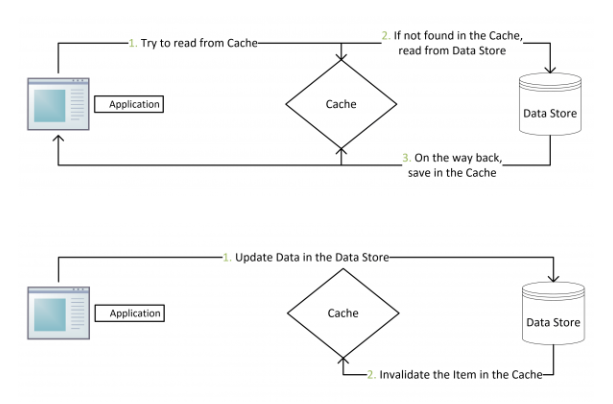

# 过期策略+Redis内存淘汰机制

作为一种定期清理无效数据的重要机制，主键失效存在于大多数缓存系统中，Redis 也不例外。在 Redis 提供的诸多命令中，EXPIRE、EXPIREAT、PEXPIRE、PEXPIREAT 以及 SETEX 和 PSETEX 均可以用来设置一条 Key-Value 对的失效时间，而一条 Key-Value 对一旦被关联了失效时间就会在到期后自动删除（或者说变得无法访问更为准确）。可以说，主键失效这个概念还是比较容易理解的，但是在具体实现到 Redis 中又是如何呢？

> 常用方式: （timestamp为unix时间戳（例如：timestamp=1499788800 表示将在2017.07.12过期））

```python
1.EXPRISE key seconds        //将key的生存时间设置为ttl秒
2.PEXPIRE key milliseconds   //将key的生成时间设置为ttl毫秒
3.EXPIREAT key timestamp     //将key的过期时间设置为timestamp所代表的的秒数的时间戳
4.PEXPIREAT key milliseconds-timestamp  //将key的过期时间设置为timestamp所代表的的毫秒数的时间戳
```

> **应用**场景：1、2两种方式是设置一个过期的时间段，就是咱们处理验证码最常用的策略，设置三分钟或五分钟后失效，把分钟数转换成秒或毫秒存储到Redis中。 
> 3、4两种方式是指定一个过期的时间 ，比如优惠券的过期时间是某年某月某日，只是单位不一样。

> SETEX KEY_NAME TIMEOUT VALUE  设置可过期的键值

## 1. RedisDB 结构体

```
typedef struct redisDb {
    dict *dict;
    dict *expires;
    dict *blocking_keys;
    dict *ready_keys;
    dict *watched_keys;
    int id;
} redisDb;
```

Redis 中关于数据库的结构体定义，这个结构体定义中除了 id 以外都是指向字典的指针，其中我们只看 dict 和 expries，前者用来维护一个 Redis 数据库中包含的所有 Key-Value 对（其结构可以理解为 dict[key]:value，即主键与值之间的映射），后者则用于维护一个 Redis 数据库中设置了失效时间的主键（其结构可以理解为 expires[key]:timeout，即主键与失效时间的映射）。当我们使用 SETEX 和 PSETEX 命令向系统插入数据时，Redis 首先将 Key 和 Value 添加到 dict 这个字典表中，然后将 Key 和失效时间添加到 expires 这个字典表中。当我们使用 EXPIRE、EXPIREAT、PEXPIRE 和 PEXPIREAT 命令设置一个主键的失效时间时，Redis 首先到 dict 这个字典表中查找要设置的主键是否存在，如果存在就将这个主键和失效时间添加到 expires 这个字典表。简单地总结来说就是，设置了失效时间的主键和具体的失效时间全部都维护在 expires 这个字典表中。

数据库主要有dict和expires两个字典构成

## 2. 过期策略

### 2.1 定时删除

- 定义：在设置key的过期时间的同时，为该key创建一个定时器，让定时器在key的过期时间来临时，对key进行删除
- 优点：保证内存的尽快释放
- 缺点：若过期key很多，删除这些key会占用很多的CPU时间，在CPU时间紧张的情况下，CPU不能把所有的时间用来做要紧的事儿，还需要去花时间删除这些key，定时器的创建耗时，若为每一个设置过期时间的key创建一个定时器（将会有大量的定时器产生），性能影响严重

### 2.2 惰性删除

- 定义：key过期的时候不删除，每次从数据库获取key的时候检查是否过期，若过期，则删除，返回null。
- 优点：删除操作只发生在从数据库取出key的时候发生，而且只删除当前key，所以对CPU时间的占用是比较少的，而且此时的删除是已经到了非做不可的地步
- 缺点：若大量的key在超出超时时间后，很久一段时间内，都没有被获取过，那么可能发生内存泄露（无用的垃圾占用了大量的内存）

### 2.3 定期删除

- 定义：每隔一段时间进行一次删除过期key的操作
- 优点：通过限制删除操作的时长和频率，来减少删除操作对CPU时间的占用--处理"定时删除"的缺点， 解决惰性删除的缺点
- 缺点：在内存友好方面不如 定时删除， 在CPU时间友好方面，不如惰性删除


## 3. Redis 使用的过期删除策略

### 3. 1 消极方法 - 惰性删除

```c++
int expireIfNeeded(redisDb *db, robj *key) {
    // 获取主键的失效时间
    long long when = getExpire(db, key);
    //假如失效时间为负数，说明该主键未设置失效时间（失效时间默认为-1），直接返回0
    if (when < 0) return 0;
    //假如Redis服务器正在从RDB文件中加载数据，暂时不进行失效主键的删除，直接返回0
    if (server.loading) return 0;
    //假如当前的Redis服务器是作为Slave运行的，那么不进行失效主键的删除，因为Slave
    //上失效主键的删除是由Master来控制的，但是这里会将主键的失效时间与当前时间进行
    //一下对比，以告知调用者指定的主键是否已经失效了
    if (server.masterhost != NULL) {
        return mstime() > when;
    }
    //如果以上条件都不满足，就将主键的失效时间与当前时间进行对比，如果发现指定的主键
    //还未失效就直接返回0
    if (mstime() <= when) return 0;
    //如果发现主键确实已经失效了，那么首先更新关于失效主键的统计个数，然后将该主键失
    //效的信息进行广播，最后将该主键从数据库中删除
    server.stat_expiredkeys++;
    propagateExpire(db, key);
    return dbDelete(db, key);
}
```

这个函数在任何访问数据的函数中都会被调用，也就是说 Redis 在实现 GET、MGET、HGET、LRANGE 等所有涉及到读取数据的命令时都会调用它，它存在的意义就是在读取数据之前先检查一下它有没有失效，如果失效了就删除它。

```c++
void propagateExpire(redisDb *db, robj *key) {
    robj *argv[2];
    //shared.del是在Redis服务器启动之初就已经初始化好的一个常用Redis对象，即DEL命令
    argv[0] = shared.del;
    argv[1] = key;
    incrRefCount(argv[0]);
    incrRefCount(argv[1]);
    //检查Redis服务器是否开启了AOF，如果开启了就为失效主键记录一条DEL日志
    if (server.aof_state != REDIS_AOF_OFF)
        feedAppendOnlyFile(server.delCommand,db->id,argv,2);
    //检查Redis服务器是否拥有Slave，如果是就向所有Slave发送DEL失效主键的命令，这就是
    //上面expireIfNeeded函数中发现自己是Slave时无需主动删除失效主键的原因了，因为它
    //只需听从Master发送过来的命令就OK了
    if (listLength(server.slaves))
        replicationFeedSlaves(server.slaves,db->id,argv,2);
    decrRefCount(argv[0]);
    decrRefCount(argv[1]);
}
```

需要说明的是在 expireIfNeeded 函数中调用的另外一个函数 propagateExpire，这个函数用来在正式删除失效主键之前广播这个主键已经失效的信息，这个信息会**传播**到两个目的地：**一个是发送到 AOF文件，将删除失效主键的这一操作以 DEL Key 的标准命令格式记录下来**；另一个就是发送到当前 **Redis 服务器的所有 Slave**，同样将删除失效主键的这一操作以 DEL Key 的标准命令格式告知这些 Slave 删除各自的失效主键。从中我们可以知道，所有作为 Slave 来运行的 Redis 服务器并不需要通过消极方法来删除失效主键，它们只需要对 Master 唯命是从就 OK 了！

### 3.2 积极方法 - 定期删除

以上我们通过对 expireIfNeeded 函数的介绍了解了 Redis 是如何以一种消极的方式删除失效主键的，但是仅仅通过这种方式显然是不够的，因为如果某些失效的主键迟迟等不到再次访问的话，Redis 就永远不会知道这些主键已经失效，也就永远也不会删除它们了，这无疑会导致内存空间的浪费。因此，Redis 还准备了一招积极的删除方法，该方法利用 **Redis 的时间事件来实现**，即每隔一段时间就中断一下完成一些指定操作，其中就包括检查并删除失效主键。这里我们说的**时间事件的回调函数就是 `serverCron`**，它在 Redis 服务器启动时创建，每秒的执行次数由宏定义 `REDIS_DEFAULT_HZ` 来指定，默认每秒钟执行10次。以下代码给出该时间事件创建时的程序代码，该代码在 `redis.c`文件的 `initServer` 函数中。实际上，`serverCron` 这个回调函数不仅要进行失效主键的检查与删除，还要进行统计信息的更新、客户端连接超时的控制、`BGSAVE` 和 `AO` 的触发等等，这里我们仅关注删除失效主键的实现，也就是函数 `activeExpireCycle`。

```c++
if(aeCreateTimeEvent(server.el, 1, serverCron, NULL, NULL) == AE_ERR) {
        redisPanic("create time event failed");
        exit(1);
}
```

函数 `activeExpireCycle` 的实现及其详细描述，其主要实现原理就是**遍历处理 Redis 服务器中每个数据库的 expires 字典表中**，从中尝试着随机抽样 	`REDIS_EXPIRELOOKUPS_PER_CRON`（默认值为10）个设置了失效时间的主键，检查它们是否已经失效并删除掉失效的主键，如果失效的主键个数占本次抽样个数的**比例超过25%**，Redis 会认为当前数据库中的失效主键依然很多，所以它会继续进行下一轮的随机抽样和删除，直到刚才的比例低于25%才停止对当前数据库的处理，转向下一个数据库。这里我们需要注意的是，`activeExpireCycle` 函数不会试图一次性处理Redis中的所有数据库，**而是最多只处理 `REDIS_DBCRON_DBS_PER_CALL`（默认值为16）**，此外 `activeExpireCycle` 函数还有**处理时间上的限制**，不是想执行多久就执行多久，凡此种种都只有一个目的，那就是避免失效主键删除占用过多的CPU资源

```c++
void activeExpireCycle(void) {
    static unsigned int current_db = 0;
    static int timelimit_exit = 0;
    unsigned int j, iteration = 0;
    unsigned int dbs_per_call = REDIS_DBCRON_DBS_PER_CALL
    long long start = ustime(), timelimit;
    
    if (dbs_per_call) > server.dbnum || timelimit_exit)
        db_per_call = server.dbnum;
    
}
```

```c++
void activeExpireCycle(void) {
    //因为每次调用activeExpireCycle函数不会一次性检查所有Redis数据库，所以需要记录下
    //每次函数调用处理的最后一个Redis数据库的编号，这样下次调用activeExpireCycle函数
    //还可以从这个数据库开始继续处理，这就是current_db被声明为static的原因，而另外一
    //个变量timelimit_exit是为了记录上一次调用activeExpireCycle函数的执行时间是否达
    //到时间限制了，所以也需要声明为static
    static unsigned int current_db = 0;
    static int timelimit_exit = 0;
    unsigned int j, iteration = 0;
    //每次调用activeExpireCycle函数处理的Redis数据库个数为REDIS_DBCRON_DBS_PER_CALL
    unsigned int dbs_per_call = REDIS_DBCRON_DBS_PER_CALL;
    long long start = ustime(), timelimit;
    //如果当前Redis服务器中的数据库个数小于REDIS_DBCRON_DBS_PER_CALL，则处理全部数据库，
    //如果上一次调用activeExpireCycle函数的执行时间达到了时间限制，说明失效主键较多，也
    //会选择处理全部数据库
    if (dbs_per_call > server.dbnum || timelimit_exit)
        dbs_per_call = server.dbnum;
    //执行activeExpireCycle函数的最长时间（以微秒计），其中REDIS_EXPIRELOOKUPS_TIME_PERC
    //是单位时间内能够分配给activeExpireCycle函数执行的CPU时间比例，默认值为25，server.hz
    //即为一秒内activeExpireCycle的调用次数，所以这个计算公式更明白的写法应该是这样的，即
    (1000000 * (REDIS_EXPIRELOOKUPS_TIME_PERC / 100)) / server.hz
    timelimit = 1000000*REDIS_EXPIRELOOKUPS_TIME_PERC/server.hz/100;
    timelimit_exit = 0;
    if (timelimit <= 0) timelimit = 1;
    //遍历处理每个Redis数据库中的失效数据
    for (j = 0; j < dbs_per_call; j++) {
        int expired;
        redisDb *db = server.db+(current_db % server.dbnum);
        //此处立刻就将current_db加一，这样可以保证即使这次无法在时间限制内删除完所有当前
        //数据库中的失效主键，下一次调用activeExpireCycle一样会从下一个数据库开始处理，
        //从而保证每个数据库都有被处理的机会
        current_db++;
        //开始处理当前数据库中的失效主键
        do {
            unsigned long num, slots;
            long long now;
            //如果expires字典表大小为0，说明该数据库中没有设置失效时间的主键，直接检查下
            //一数据库
            if ((num = dictSize(db->expires)) == 0) break;
            slots = dictSlots(db->expires);
            now = mstime();
            //如果expires字典表不为空，但是其填充率不足1%，那么随机选择主键进行检查的代价
            //会很高，所以这里直接检查下一数据库
            if (num && slots > DICT_HT_INITIAL_SIZE &&
                (num*100/slots < 1)) break;
            expired = 0;
            //如果expires字典表中的entry个数不足以达到抽样个数，则选择全部key作为抽样样本
            if (num > REDIS_EXPIRELOOKUPS_PER_CRON)
                num = REDIS_EXPIRELOOKUPS_PER_CRON;
            while (num--) {
                dictEntry *de;
                long long t;
                //随机获取一个设置了失效时间的主键，检查其是否已经失效
                if ((de = dictGetRandomKey(db->expires)) == NULL) break;
                t = dictGetSignedIntegerVal(de);
                if (now > t) {
                    //发现该主键确实已经失效，删除该主键
                    sds key = dictGetKey(de);
                    robj *keyobj = createStringObject(key,sdslen(key));
                    //同样要在删除前广播该主键的失效信息
                    propagateExpire(db,keyobj);
                    dbDelete(db,keyobj);
                    decrRefCount(keyobj);
                    expired++;
                    server.stat_expiredkeys++;
                }
            }
            //每进行一次抽样删除后对iteration加一，每16次抽样删除后检查本次执行时间是否
            //已经达到时间限制，如果已达到时间限制，则记录本次执行达到时间限制并退出
            iteration++;
            if ((iteration & 0xf) == 0 &&
                (ustime()-start) > timelimit)
            {
                timelimit_exit = 1;
                return;
            }
        //如果失效的主键数占抽样数的百分比大于25%，则继续抽样删除过程
        } while (expired > REDIS_EXPIRELOOKUPS_PER_CRON/4);
    }
}
```

## 4. Memcached 删除失效主键的方法与 Redis 有何异同？

[**Memcached与Redis**](https://www.imooc.com/article/23549)

Memcache在删除失效主键时也是采用消极方法，即Memcached 内部也不会监视主键是否失效，而是在通过Get访问主键时才会检查是否失效。其次，Memcached 与 Redis 在主键失效机制上的最大不同是，Memcached 不会像 Redis 那样真正地去删除失效的主键，而只是简单地将失效主键占用的空间回收。这样当有新的数据写入到系统中时，Memcached 会优先使用那些失效主键的空间。如果失效主键的空间用光了，Memcached 还可以通过 LRU 机制来回收那些长期得不到访问的空间，因此 Memcached 并不需要像 Redis 中那样的周期性删除操作，这也是由 Memcached 使用的内存管理机制决定的。同时，这里需要指出的是 Redis 在出现 **OOM**（内存不足） 时同样可以通过配置maxmemory-policy 这个参数来决定是否采用 [LRU机制](https://xenojoshua.com/2013/07/redis-lru/)来回收内存空间。可以在配置文件中配置删除算法:

```shell
# MAXMEMORY POLICY: how Redis will select what to remove when maxmemory
# is reached? You can select among five behavior:
#
# volatile-lru -> remove the key with an expire set using an LRU algorithm
# allkeys-lru -> remove any key accordingly to the LRU algorithm
# volatile-random -> remove a random key with an expire set
# allkeys-random -> remove a random key, any key
# volatile-ttl -> remove the key with the nearest expire time (minor TTL)
# noeviction -> don't expire at all, just return an error on write operations
```

### 4.1 Reids中内存淘汰机制

[Redis-LRU-Cache](https://redis.io/topics/lru-cache) [LRU原理和Redis实现——一个今日头条的面试题](https://zhuanlan.zhihu.com/p/34133067)


**使用HashMap+双向链表进行淘汰过期键。**如果按照HashMap和双向链表实现，需要额外的存储存放 next 和 prev 指针，牺牲比较大的存储空间，显然是不划算的。所以Redis采用了一个近似的做法，就是随机取出若干个key，然后按照访问时间排序后，淘汰掉最不经常使用的，具体分析如下：

Redis支持和LRU相关淘汰策略包括

- noeviction：当内存不足以容纳新写入数据时，新写入操作会报错
- volatile-ttl：在设置了过期时间的键空间中，有更早过期时间的key优先移除

- volatile-lru：在键空间中，设置了过期的key参与近似的LRU淘汰策略
- volatile-random：在键空间中，移除最近最少使用的key
- allkeys-lru：所有的key均参与近似的lru淘汰策略
- allkeys-random：在键空间中，随机移除某个key

> redis 4.x 后支持LFU策略，使用频率最少的最先删除

为了支持LRU，Redis 2.8.19中使用了一个全局的LRU时钟，`server.lruclock`，定义如下，

```cpp
#define REDIS_LRU_BITS 24
unsigned lruclock:REDIS_LRU_BITS; /* Clock for LRU eviction */
```

默认的LRU时钟的分辨率是1秒，可以通过改变`REDIS_LRU_CLOCK_RESOLUTION`宏的值来改变，Redis会在`serverCron()`中调用`updateLRUClock`定期的更新LRU时钟，更新的频率和hz参数有关，默认为`100ms`j检测一次，如下，

```cpp
#define REDIS_LRU_CLOCK_MAX ((1<<REDIS_LRU_BITS)-1) /* Max value of obj->lru */
#define REDIS_LRU_CLOCK_RESOLUTION 1 /* LRU clock resolution in seconds */

void updateLRUClock(void) {
    server.lruclock = (server.unixtime / REDIS_LRU_CLOCK_RESOLUTION) &
                                                REDIS_LRU_CLOCK_MAX;
}
```

Redis会基于`server.maxmemory_samples`配置选取固定数目的key，然后比较它们的lru访问时间，然后淘汰最近最久没有访问的key，`maxmemory_samples`的值越大，Redis的近似LRU算法就越接近于严格LRU算法，但是相应消耗也变高，对性能有一定影响，样本值默认为5。

**思考：MySQL数据库中有1000w的数据，而redis中只有50w数据，如何保证redis中10w数据都是热点数据？**

考核的就是redis的内存淘汰策略：

方案：

 限定 Redis 占用的内存，Redis 会根据自身数据淘汰策略，留下热数据到内存。所以，计算一下 50W 数据大约占用的内存，然后设置一下 Redis 内存限制即可，并将淘汰策略为volatile-lru或者allkeys-lru。  

设置Redis最大占用内存：

打开redis配置文件，设置maxmemory参数，maxmemory是bytes字节类型

```shell

# In short... if you have slaves attached it is suggested that you set a lower
# limit for maxmemory so that there is some free RAM on the system for slave
# output buffers (but this is not needed if the policy is 'noeviction').
#
# maxmemory <bytes>
maxmemory 268435456
```

设置过期策略：

```shell
maxmemory-policy volatile-lru
```


## 5. Reids的主键失效机制会不会影响系统性能？

以下几种机制大大降低了主键失效机制对系统性能的影响。

- 对每次处理数据库个数限制
- 限制activeExpireCycle 函数在一秒内执行次数 server.hz
- 限制分配给activeExpireCycle函数的CPU时间
- 失效主键占抽样个数的百分比限制

## 6. 应用 缓存更新的套路

### 6.1 常规套路 Cache Aside Pattern

- 失效：应用程序先从cache取数据，没有得到，则从数据库中取数据，成功后，放到缓存中。
- 命中：应用程序从cache中取数据，取到后返回
- 更新：先把数据存到数据库，成功后，在让缓存失效




## 7 缓存问题

[缓存穿透，缓存击穿，缓存雪崩解决方案分析](https://blog.csdn.net/zeb_perfect/article/details/54135506)

### 7.1 缓存穿透

缓存只是为了缓解数据库压力而添加的一层保护层，当从缓存中查询不到我们需要的数据就要去数据库中查询了。如果被黑客利用，频繁去访问缓存中没有的数据，那么缓存就失去了存在的意义，瞬间所有请求的压力都落在了数据库上，这样会导致数据库连接异常。

解决方案：

1. 约定编程：对于返回NULL的key依然缓存，对于跑出异常的返回不进行缓存，这种手段可能会增加缓存的维护成本，可以设置较短的过期时间来解决这个问题。
2. 指定一些过滤规则，过滤一些不正常的数据，小数据用BitMap，大数据可以用布隆过滤器，将所有可能存在的数据哈希到一个足够大的bitmap中，一个一定不存在的数据会被 这个bitmap拦截掉，从而避免了对底层存储系统的查询压力。比如你的订单ID明显是在一个范围内的（1-10000）, 来了个超出范围的数据就可以直接过滤掉

### 7.2 缓存雪崩

缓存雪崩是指缓存不可用或者大量缓存由于超时时间相同在同一时间段失效，大量请求直接访问数据库，数据库压力过大导致系统雪崩。

解决方案：

1. 给缓存加上一定区间内的随机生效时间，不同的key设置不同的失效时间，避免同一时间集体失效。比如以前是设置10分钟的超时时间，那每个Key都可以随机8-13分钟过期，尽量让不同Key的过期时间不同。
2. 采用多级缓存，不同缓存级别设置的过期时间不同
3. 
   - 实发前：使用集群缓存，保证缓存服务的高可用 Redis+ Sentinel + Redis Cluster
   - 实发中：**ehcache 本地缓存** + **Hystrix限流&降级(netflix)**，避免MySQL被打死，使用 Hystrix进行限流 & 降级 ，比如一秒来了5000个请求，我们可以设置假设只能有一秒 2000个请求能通过这个组件，那么其他剩余的 3000 请求就会走限流逻辑 （[**Hystrix**](https://github.com/Netflix/Hystrix)是一种开源的“抗雪崩工具”，**降级（downgrade）**和**限流（current limit）**来减少雪崩后的损耗）
4. 利用加锁或者队列方式避免过多请求对服务器进行读写操作，单线程的对缓存进行写操作

### 7.3 缓存击穿(热点数据集失效**Hotspot data set is invalid**)

对于一些设置了过期时间的key，如果这些key可能会在某些时间点被超高并发地访问，是一种非常“热点”的数据。这个时候，需要考虑一个问题：缓存被“击穿”的问题，这个和缓存雪崩的区别在于这里针对某一key缓存，前者则是很多key。缓存在某个时间点过期的时候，恰好在这个时间点对这个Key有大量的并发请求过来，这些请求发现缓存过期一般都会从后端DB加载数据并回设到缓存，这个时候大并发的请求可能会瞬间把后端DB压垮。

解决方法：

1. 使用互斥锁（mutex key）我们可以使用缓存附带的**锁定机制**。启动第一个数据库查询请求时，将锁定缓存中的数据；此时，到达缓存的其他查询请求将**无法**查询该字段，因此将被**阻塞等待**；请求完成数据库查询并缓存数据更新值后，锁定被**释放**；此时，可以直接从缓存中检索其他阻止的查询请求。

   SETNX [官方实现](https://redis.io/commands/set#patterns)，是「SET if Not eXists」的缩写，也就是只有不存在的时候才设置，可以利用它来实现锁的效果[使用Redis SETNX 命令实现分布式锁](https://blog.csdn.net/lihao21/article/details/49104695)

参考：

1. [深入理解Redis主键失效原理及实现机制](https://www.aidandai.com/posts/redis-expire.html)
2. [原文：梁喜健-深入理解Redis中的主键失效及其实现机制](http://blog.sina.com.cn/s/blog_48c95a190101e5hv.html)
3. [Redis的LRU机制](https://xenojoshua.com/2013/07/redis-lru/)
4. [LRU原理和Redis实现——一个今日头条的面试题](https://zhuanlan.zhihu.com/p/34133067)
5. [缓存更新的套路](https://coolshell.cn/articles/17416.html)